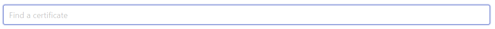
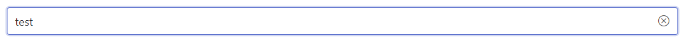
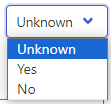
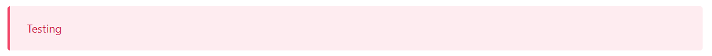
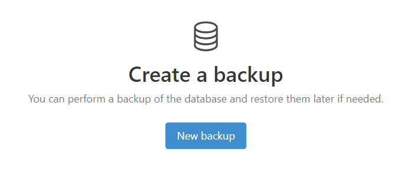
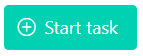
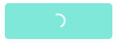
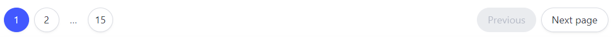

# VueJS Templates
All of the templates that I use with VueJS.

Requires [Bulma CSS](https://bulma.io).

Each component can be copied to a project.

## Build
```bash
npm pack
```

## Components
### Input
#### SearchInput
Search bar input with a cross to remove input text with one click.




#### UYN
Select dropdown with the values "Yes", "No" and "Unknown".



### Message
[Message box](https://bulma.io/documentation/components/message/).
By default uses the `is-danger` color, but can be changed with the `type` property.

```vue
<Message type="info">An info message</Message>
```



### Startup
Display a message when no data is available and we want to guide the user to do something (e.g. create new data, start a process...).
Inspired by some beautiful [ELK](https://elastic.co) UI.



```vue
<Startup icon="database">
  <template #title>
    Create a backup
  </template>
  <p>You can perform a backup of the database and restore them later if needed.</p>
  <template #actions>
    <TaskButton :is-disabled="isBackupDisabled.value" :title="isBackupDisabled.reason" :task="task_createNewBackup(db)" class="button is-dark is-info">New backup</TaskButton>
  </template>
</Startup>
```

### TaskButton
Button that executes a Promise when clicked on. Useful to provide long-task user feedback by automatically showing a loading button in the UI.





```vue
<TaskButton :task="() => longTask()" class="button is-primary">
  <span class="icon"><i class="bi bi-plus-circle"></i></span>
  <span>Start task</span>
</TaskButton>
```

### Pagination
#### Pagination
[Pagination](https://bulma.io/documentation/components/pagination/) helper.
Uses the [Pagination](./src/ts/Pagination.ts).



### Loading
Loading bar.
